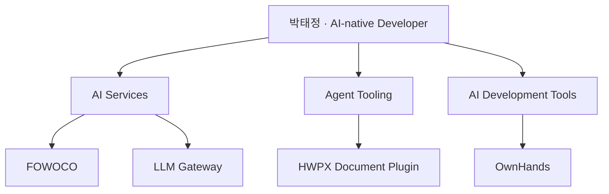

# 박태정
**AI Agent / LLM Application Developer**

AI의 작업을 통제하고 검증해, 생성물을 **이해하고 설명하며 책임질 수 있는 결과**로 만드는 AI-native 개발자.

[프로젝트](#만든-것) · [일하는 기준](#일하는-기준) · [연락](mailto:taejung3852@gmail.com)

## 만든 것

AI 서비스, Agent가 사용하는 도구, AI 개발 작업을 검토하는 도구를 만듭니다.

### AI Services

#### FOWOCO · 팀 프로젝트
검색과 AI 작업 흐름을 실제 업무에 연결하는 서비스입니다. 생성된 번역·안내문을 검증하고, 사람의 검토가 필요한 결과를 구분하는 흐름을 다룹니다.

- **참여 영역:** Language·Document/HWPX 및 Language runtime 연동.
- **관련 기술:** Hybrid Retrieval · Reranking · FastAPI
- [프로젝트 저장소](https://github.com/fowoco/ai)

#### LLM Gateway · 팀 프로젝트
여러 AI 모델을 하나의 서비스에서 사용할 수 있도록 연결하는 백엔드입니다. 모델 선택과 응답을 조금씩 전달하는 스트리밍 구조를 다룹니다.

- **담당 영역:** 백엔드·AI 아키텍처, 모델 제공자 통합과 부분 응답 전달. 프론트엔드는 팀원이 담당했습니다.
- **관련 기술:** Spring Boot · LangChain4j · Ollama
- 저장소는 현재 비공개입니다.

### Agent Tooling

#### HWPX Document Plugin · 팀 프로젝트
AI가 HWPX 문서를 다룰 때 **분석 → 변경 계획 → 사람의 승인 → 수정 → 검증**을 거치도록 돕는 도구입니다.

- **참여 영역:** 외부 rhwp 엔진과 Python을 연결하는 인프로세스 브리지 및 렌더링 연동. 원천 렌더링 엔진 자체를 개발한 것은 아닙니다.
- **관련 기술:** MCP · Python · Rust / PyO3
- 저장소는 현재 비공개입니다.

### AI Development Tools

#### OwnHands · 개인 프로젝트
AI의 개발 작업을 통제하고 검토하는 도구입니다. 무엇을 했는지 보여주는 **근거와 검증을 사람의 판단에 연결**합니다.

- **개발 방향:** 작업 범위, 수행 근거, 검증 결과를 함께 확인할 수 있는 구조.
- **목표:** AI가 만든 변경을 사람이 다시 읽고 이해하는 부담을 줄이는 것.
- 저장소는 현재 비공개입니다.

## 일하는 기준

- **통제 · Control** — AI에게 맡길 범위와 사람이 결정할 일을 구분합니다.
- **검증 · Verify** — 생성 결과를 근거로 확인합니다.
- **이해 · Understand** — 생성물과 기술을 이해하고, 필요한 부분을 수정해 내 것으로 만듭니다.
- **설명 · Explain** — 다른 사람이 판단할 수 있도록 맥락과 근거를 전달합니다.
- **책임 · Accountability** — 최종 판단과 책임은 사람이 가집니다.

## 교육 & 자격증

**KT AIVLE School** 9기 AI 개발자 트랙 (2026.03 ~ 2026.09)  
AICE Associate · ISTQB CTFL · 정보처리기사 · SQLD · ADsP

이전 프로젝트

**[SpecFlow](https://github.com/taejung3852/SpecFlow)** · 개인 프로젝트  
코드·문서 배치 자동 문서화. Planner-Executor-Critic와 Reflection 루프를 다룹니다.  
LangGraph · RAG · LangSmith

## 연락

[taejung3852@gmail.com](mailto:taejung3852@gmail.com)
