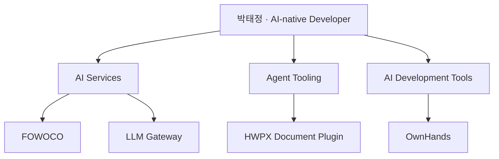

  <picture>
    <source media="(prefers-color-scheme: dark)" srcset="https://capsule-render.vercel.app/api?type=waving&amp;color=0:05070a,50:172033,100:05070a&amp;height=220&amp;section=header&amp;text=TAEJUNG%20PARK&amp;fontSize=48&amp;fontColor=f8fafc&amp;animation=twinkling&amp;fontAlignY=35&amp;desc=AI%20Agent%20%C2%B7%20LLM%20Application%20Developer&amp;descSize=17&amp;descColor=cbd5e1&amp;descAlignY=61" />
    <source media="(prefers-color-scheme: light)" srcset="https://capsule-render.vercel.app/api?type=waving&amp;color=0:f8fafc,50:e2e8f0,100:f8fafc&amp;height=220&amp;section=header&amp;text=TAEJUNG%20PARK&amp;fontSize=48&amp;fontColor=111827&amp;animation=twinkling&amp;fontAlignY=35&amp;desc=AI%20Agent%20%C2%B7%20LLM%20Application%20Developer&amp;descSize=17&amp;descColor=475569&amp;descAlignY=61" />
    
  </picture>

  

# 박태정

**AI Agent / LLM Application Developer**

AI의 작업을 통제하고 검증해, 생성물을 **이해하고 설명하며 책임질 수 있는 결과**로 만드는 AI-native 개발자.

  
  
  

<picture>
  <source media="(prefers-color-scheme: dark)" srcset="https://capsule-render.vercel.app/api?type=soft&amp;color=0:111827,50:f59e0b,100:111827&amp;height=3&amp;section=header" />
  <source media="(prefers-color-scheme: light)" srcset="https://capsule-render.vercel.app/api?type=soft&amp;color=0:e5e7eb,50:d97706,100:e5e7eb&amp;height=3&amp;section=header" />
  
</picture>

## 만든 것

AI 서비스, Agent가 사용하는 도구, AI 개발 작업을 검토하는 도구를 만듭니다. 아래 지도는 각 프로젝트가 어느 문제 영역에 놓이는지 보여줍니다.

### AI Services

#### FOWOCO · 팀 프로젝트
검색과 AI 작업 흐름을 실제 업무에 연결하는 서비스입니다. 생성된 번역·안내문을 검증하고, 사람의 검토가 필요한 결과를 구분하는 흐름을 다룹니다.

- **참여 영역:** Language·Document/HWPX 및 Language runtime 연동
- **관련 기술:** Hybrid Retrieval · Reranking · FastAPI
- [프로젝트 저장소](https://github.com/fowoco/ai)

#### LLM Gateway · 팀 프로젝트
여러 AI 모델을 하나의 서비스에서 사용할 수 있도록 연결하는 백엔드입니다. 모델 선택과 응답을 조금씩 전달하는 스트리밍 구조를 다룹니다.

- **담당 영역:** 백엔드·AI 아키텍처, 모델 제공자 통합과 부분 응답 전달. 프론트엔드는 팀원이 담당했습니다.
- **관련 기술:** Spring Boot · LangChain4j · Ollama
- 저장소는 현재 비공개입니다.

### Agent Tooling

#### HWPX Document Plugin · 팀 프로젝트
AI가 HWPX 문서를 다룰 때 **분석 → 변경 계획 → 사람의 승인 → 수정 → 검증**을 거치도록 돕는 도구입니다.

- **참여 영역:** 외부 rhwp 엔진과 Python을 연결하는 인프로세스 브리지 및 렌더링 연동. 원천 렌더링 엔진 자체를 개발한 것은 아닙니다.
- **관련 기술:** MCP · Python · Rust / PyO3
- 저장소는 현재 비공개입니다.

### AI Development Tools

#### OwnHands · 개인 프로젝트
AI의 개발 작업을 통제하고 검토하는 도구입니다. 무엇을 했는지 보여주는 **근거와 검증을 사람의 판단에 연결**합니다.

- **개발 방향:** 작업 범위, 수행 근거, 검증 결과를 함께 확인할 수 있는 구조
- **목표:** AI가 만든 변경을 사람이 다시 읽고 이해하는 부담을 줄이는 것
- 저장소는 현재 비공개입니다.

<picture>
  <source media="(prefers-color-scheme: dark)" srcset="https://capsule-render.vercel.app/api?type=soft&amp;color=0:111827,50:f59e0b,100:111827&amp;height=3&amp;section=header" />
  <source media="(prefers-color-scheme: light)" srcset="https://capsule-render.vercel.app/api?type=soft&amp;color=0:e5e7eb,50:d97706,100:e5e7eb&amp;height=3&amp;section=header" />
  
</picture>

## 일하는 기준

| 기준 | 실제로 하는 일 |
|---|---|
| **Control · 통제** | AI에게 맡길 범위와 사람이 결정할 일을 구분합니다. |
| **Verify · 검증** | 생성 결과를 근거로 확인합니다. |
| **Understand · 이해** | 생성물과 기술을 이해하고, 필요한 부분을 수정해 내 것으로 만듭니다. |
| **Explain · 설명** | 다른 사람이 판단할 수 있도록 맥락과 근거를 전달합니다. |
| **Accountability · 책임** | 최종 판단과 책임은 사람이 가집니다. |

## 기술 환경

프로젝트에서 사용한 기술을 중심으로 표시했습니다.

  <picture>
    <source media="(prefers-color-scheme: dark)" srcset="https://skillicons.dev/icons?i=py,fastapi,java,spring,rust,docker,git,github&amp;theme=dark&amp;perline=8" />
    <source media="(prefers-color-scheme: light)" srcset="https://skillicons.dev/icons?i=py,fastapi,java,spring,rust,docker,git,github&amp;theme=light&amp;perline=8" />
    
  </picture>

## 활동

<picture>
  <source media="(prefers-color-scheme: dark)" srcset="https://github-readme-activity-graph.vercel.app/graph?username=taejung3852&amp;bg_color=0d1117&amp;color=c9d1d9&amp;line=f59e0b&amp;point=ffffff&amp;area=true&amp;hide_border=true" />
  <source media="(prefers-color-scheme: light)" srcset="https://github-readme-activity-graph.vercel.app/graph?username=taejung3852&amp;bg_color=ffffff&amp;color=24292f&amp;line=d97706&amp;point=111827&amp;area=true&amp;hide_border=true" />
  
</picture>

<picture>
  <source media="(prefers-color-scheme: dark)" srcset="https://raw.githubusercontent.com/taejung3852/taejung3852/output/github-contribution-grid-snake-dark.svg" />
  <source media="(prefers-color-scheme: light)" srcset="https://raw.githubusercontent.com/taejung3852/taejung3852/output/github-contribution-grid-snake.svg" />
  
</picture>

## 교육 & 자격증

**KT AIVLE School** 9기 AI 개발자 트랙 (2026.03 ~ 2026.09)  
AICE Associate · ISTQB CTFL · 정보처리기사 · SQLD · ADsP

<strong>이전 프로젝트 · SpecFlow</strong>

**[SpecFlow](https://github.com/taejung3852/SpecFlow)** · 개인 프로젝트  
코드·문서 배치 자동 문서화. Planner-Executor-Critic와 Reflection 루프를 다룹니다.  
LangGraph · RAG · LangSmith

## 연락

  

<picture>
  <source media="(prefers-color-scheme: dark)" srcset="https://capsule-render.vercel.app/api?type=waving&amp;color=0:05070a,50:172033,100:05070a&amp;height=110&amp;section=footer" />
  <source media="(prefers-color-scheme: light)" srcset="https://capsule-render.vercel.app/api?type=waving&amp;color=0:f8fafc,50:e2e8f0,100:f8fafc&amp;height=110&amp;section=footer" />
  
</picture>
